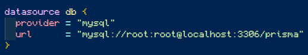

### Projeto simples de uma api para cadastramento 

### Tecnologias

    <ul>
        <li>
            <h3> Backend </h3>
            <ul>
                <li>TypeScript</li>
                <li>Express</li>
                <li>Prisma</li>
                <li>Cors</li>
                <li>
                    <s>Multer</s>
                </li>
            </ul>
        </li>
        <li>
            <h3> Frontend </h3>
            <ul>
                <li> Em andamento </li>
            </ul>
        </li>
    </ul>

## Para rodar a aplicação: 
Você precisa configurar sua string de conexão ao banco de dados (Mysql)

aqui na url a minha máquina local se conecta como <b>usuario: root </b> e <b>senha: root</b>. Mude se o seu usuário e senha for diferente

 
Instale as dependências:

    $ npm i 
    $ npx prisma migrate dev --name init
    $ npm run start

## Servidor
<a href='http://localhost:3000'> porta 3000</a>

## Rotas

    (GET) / -> retorna a página principal
    (GET) /id -> retorna o perfil do id correspondente
    (GET) /lista-usuarios -> retorna todos os perfis de todos os usuários 
    (POST) /cadastro -> adiciona ao banco de dados o novo perfil (contendo nome, email e senha). Retorna 409 se já existir.
    (DELETE) /remove -> remove um usuário por ID
    (PUT) /edita  -> edita um usuário específico
